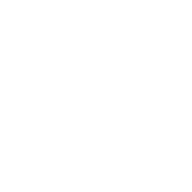
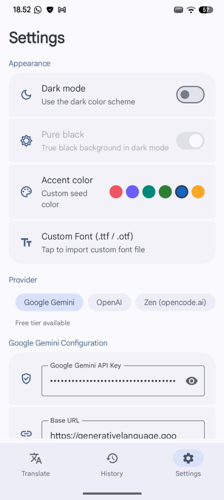

<div align="center">
  
  <h1>KZKT</h1>

  <p>
    <a href="LICENSE"></a>
    <a href="https://kotlinlang.org/"></a>
    <a href="https://developer.android.com"></a>
    <a href="https://onnxruntime.ai/"></a>
    <a href="https://opencv.org/"></a>
  </p>

  <p>
    <a href="README.md"></a>
    <a href="README.id.md"></a>
  </p>
</div>

KZKT is a native Android application for automatic manga and comic translation. It detects speech bubbles on-page with on-device AI, sends the text to the LLM of your choice, and renders the translated text back into the page — all locally, with no root access required.

<div align="center">
  <table>
    <tr>
      <td align="center" width="33%"><b>Translate Screen</b></td>
      <td align="center" width="33%"><b>History Screen</b></td>
      <td align="center" width="33%"><b>Settings Screen</b></td>
    </tr>
    <tr>
      <td align="center" width="33%"></td>
      <td align="center" width="33%"></td>
      <td align="center" width="33%"></td>
    </tr>
  </table>
</div>

---

## Highlights

- **Wide input support** - single images, whole folders, multi-image share, archives (ZIP / CBZ / EPUB), and PDF files — with **PDF in → translated PDF out**.
- **Translate to 14 languages** - English, Indonesian, Japanese, Korean, Mandarin, Spanish, French, German, and more.
- **Multi-provider LLM** - Google Gemini, Anthropic, OpenAI, OpenRouter, Zen, OpenCode Go, or any OpenAI-compatible endpoint (Ollama, LM Studio, LocalAI, vLLM) — with SSE streaming, automatic fallback between providers, and on-device model detection.
- **On-device AI pipeline** - a 3-stage YOLO cascade (ONNX Runtime) detects speech bubbles locally, optional ML Kit OCR (English, Japanese, Korean, Chinese, or auto) supports non-vision models and free-text detection, and a **Smart Image Upscaler** doubles page resolution for sharper results.
- **Built-in reader** - view results page-by-page or as a scrollable **webtoon**, pinch-to-zoom up to 4x, and a **pencil editor** to touch up any bubble's text right in the app.
- **Instant PDF reader** - translated PDFs open lazily, page by page, without waiting for the whole document to be rasterized.
- **Glossary & translation memory** - keep your own term dictionary and avoid re-translating repeated bubbles.
- **Background translation & auto-update** - work continues after the app is closed (results land in `/Download/KZKT/`), and the app checks for new releases on launch, downloading them with a resumable foreground-service download.

---

## Tech Stack

| Layer | Technologies |
| :--- | :--- |
| Language & Core | Kotlin 2.4, Java 17, AGP 9.3 |
| UI | Jetpack Compose (BOM 2026.01.01), Material 3 1.5.0-alpha25, MaterialKolor (dynamic Material You theming), Navigation Compose 2.9.8, Coil 2.7 |
| Concurrency & State | Coroutines 1.9, Flow, ViewModel, DataStore Preferences 1.1.2 |
| Machine Learning | ONNX Runtime 1.29 (YOLO), ML Kit Text Recognition 16.0.1 (Latin + Japanese + Korean + Chinese) |
| Computer Vision | OpenCV 4.10.0 Android SDK (`libopencv_java4.so` C++ JNI) |
| Networking & JSON | OkHttp 4.12, Gson 2.11 |
| Persistence & Background | DataStore Preferences, WorkManager 2.11, MediaStore |
| Target API | `minSdk = 26` (Android 8.0), `compileSdk = 37`, `targetSdk = 36` |

---

## Pipeline

```text
[ Input image / manga page ]
           |
           v
[ 0. Smart upscaler ] --> optional 2x enhancement
           |
           v
[ 1. YOLO cascade (3 stages) ] --> speech-bubble boxes (on-device, ONNX)
           |
           v
[ 2. OpenCV filtering & crop ] --> remove SFX, merge overlaps, mask outside bubbles
           |
           v
[ 3. Mosaic builder ] --> pack crops into vertical RTL mosaic + red ID labels
           |
           v
[ 4. Vision LLM ] --> Gemini / Anthropic / OpenAI / OpenRouter / local
           |            (or ML Kit OCR + text-only LLM when OCR is enabled)
           v
[ 5. Text renderer & masking ] --> in-bubble mask + auto-scaled wrapped text
           |
           v
[ Output in /Download/KZKT/ ] --> visible in gallery instantly
```

---

## Project Structure

```text
├── app/
│   └── src/main/
│       ├── java/com/kzkt/app/
│       │   ├── core/           # translation pipeline, YOLO ONNX engine, OpenCV, OCR, updater
│       │   ├── core/providers/ # Gemini, Anthropic, OpenAI, OpenRouter, Zen, custom
│       │   ├── data/           # settings, history, glossary & caches (persistence)
│       │   ├── ui/             # Compose screens (Translate, History, Settings)
│       │   ├── ui/component/   # reusable Material 3 components
│       │   └── util/           # helpers
│       ├── assets/             # encrypted YOLO model (kzkt.dat) & fonts
│       └── AndroidManifest.xml
├── opencv/                     # OpenCV 4.x Android SDK module (native JNI)
├── .github/workflows/          # KZKT Trigger Debug + KZKT Auto Release (per-ABI APKs)
├── build.gradle.kts
├── settings.gradle.kts
├── Dockerfile                  # self-contained Android build image (JDK 17 + SDK)
├── BUILD_RELEASE.md            # guide: custom keystore + publishing signed releases
├── CONTRIBUTING.md             # how to contribute: branching, quality gates, releasing
├── CHANGELOG.md
├── .editorconfig               # shared editor + ktlint settings (Compose-aware)
└── README.md
```

---

## Requirements

- **JDK 17** — e.g. [Eclipse Temurin 17](https://adoptium.net/temurin/releases/?version=17).
- **Android SDK** — `compileSdk = 37`, `minSdk = 26`, `targetSdk = 36` (installed automatically via Android Studio's SDK Manager).
- **Gradle 9.6.1** — no manual install needed; the `gradlew` wrapper downloads it for you.
- **Android Studio** (latest stable) — recommended for Gradle sync, editing, and emulators.

---

## Build the APK

> The YOLO model file (`kzkt.dat`, ~100 MB) is committed directly in this repository,
> so cloning takes a bit longer to download the large file.

1. Clone the repository:
   ```bash
   git clone https://github.com/kouzen-neo/kzkt.git
   cd kzkt
   ```

2. Open in Android Studio, let Gradle sync, then build:
   ```bash
   # Debug APKs — one per ABI + a universal APK
   ./gradlew assembleDebug
   #   → app/build/outputs/apk/debug/app-<abi>-debug.apk (+ app-universal-debug.apk)

   # Faster: only the ABI of your phone (arm64-v8a for most modern devices)
   ./gradlew assembleDebug -PabiFilter=arm64-v8a
   #   → app/build/outputs/apk/debug/app-arm64-v8a-debug.apk
   ```

3. Build a **signed release APK** (R8 minified):
   ```bash
   ./gradlew assembleRelease -PabiFilter=arm64-v8a
   #   → app/build/outputs/apk/release/app-arm64-v8a-release.apk
   ```
   Release builds are signed automatically: if a `keystore.properties` file exists it is
   used, otherwise it falls back to your local debug keystore. See
   [BUILD_RELEASE.md](BUILD_RELEASE.md) for the full guide on creating and publishing
   with your own keystore (`keystore.properties.example` is provided as a template).

### Build with Docker

The repo ships a self-contained `Dockerfile` (JDK 17 + Android SDK) so you can build without installing Android Studio:

```bash
# 1. Build the builder image (first time only)
docker build -t kzkt-builder .

# 2. Debug APK (Gradle cache persists via a named volume)
docker run --rm -v kzkt-gradle:/root/.gradle \
  kzkt-builder ./gradlew assembleDebug

# 3. Release APK — falls back to your local debug keystore
#    (mount ~/.android so the keystore is available in the container)
docker run --rm -v kzkt-gradle:/root/.gradle \
  -v "$HOME/.android:/root/.android" \
  kzkt-builder ./gradlew assembleRelease -PabiFilter=arm64-v8a

# 4. Copy the APK out of the container
CID=$(docker run -d -v kzkt-gradle:/root/.gradle \
  -v "$HOME/.android:/root/.android" \
  kzkt-builder ./gradlew assembleRelease -PabiFilter=arm64-v8a)
docker wait "$CID"
docker cp "$CID:/app/app/build/outputs/apk/release/app-arm64-v8a-release.apk" .
docker rm "$CID"
```

For publishing, mount your own keystore read-only:

```bash
docker run --rm -v kzkt-gradle:/root/.gradle \
  -v "$PWD/keystore.properties:/app/keystore.properties:ro" \
  -v "$PWD/release.keystore:/app/release.keystore:ro" \
  kzkt-builder ./gradlew assembleRelease -PabiFilter=arm64-v8a
```

### Continuous Integration (GitHub Actions)

Two workflows live in `.github/workflows/`:

- **KZKT Trigger Debug** (`kzkt-trigger-debug.yml`) — on every push / pull request to
  `main`, unit tests and `assembleDebug` run inside the same Docker builder image, and the
  debug APKs are uploaded as a downloadable artifact (`kzkt-app-debug`). The debug APK uses
  its own applicationId (`com.kzkt.app.debug`) plus a distinct launcher label and icon
  color (`KZKT Debug`), so it installs alongside the release app and is easy to tell apart.
- **KZKT Auto Release** (`kzkt-auto-release.yml`) — builds **signed release APKs** for all four ABIs
  (`arm64-v8a`, `armeabi-v7a`, `x86`, `x86_64`) plus a universal APK in parallel, then creates
  a GitHub Release named `KZKT vX.Y.Z` containing every APK and a `sha256sums.txt` file, and
  posts a Telegram notification. The release description is taken from the matching section
  of `CHANGELOG.md`. Trigger it by pushing a `v*` tag, or run it manually from the Actions tab
  with a version input (e.g. `1.30.4`). The signing keystore is restored from repository
  secrets (`KEYSTORE_BASE64`, `KEYSTORE_PASSWORD`, `KEY_ALIAS`, `KEY_PASSWORD`) — see
  [BUILD_RELEASE.md](BUILD_RELEASE.md).

---

## Open-Source Acknowledgments

KZKT is made possible by the work of many open-source projects and communities:

- CYPY by [indravoyager](https://github.com/indravoyager/cypy) for the base framework.
- Translators, beta testers, and contributors who support the project.

---

## License

This project is licensed under the [MIT License](LICENSE).
